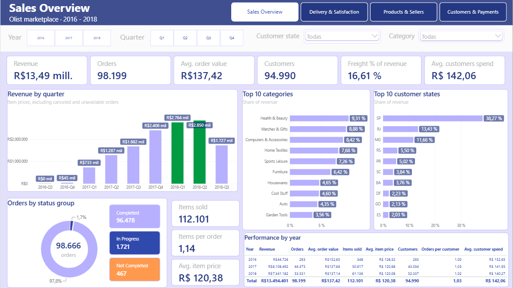
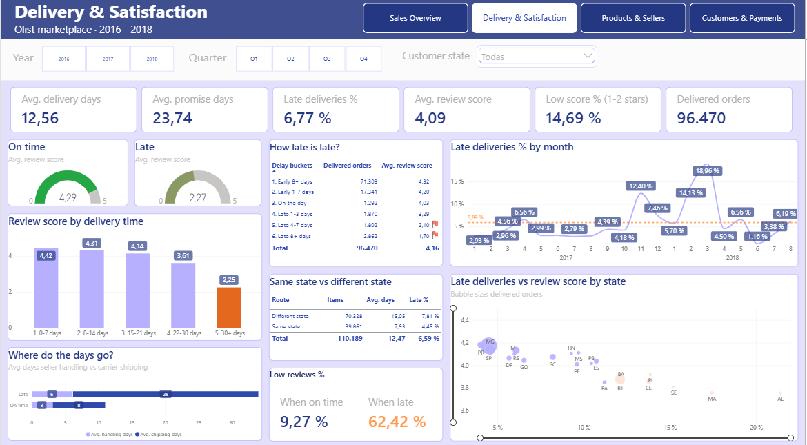
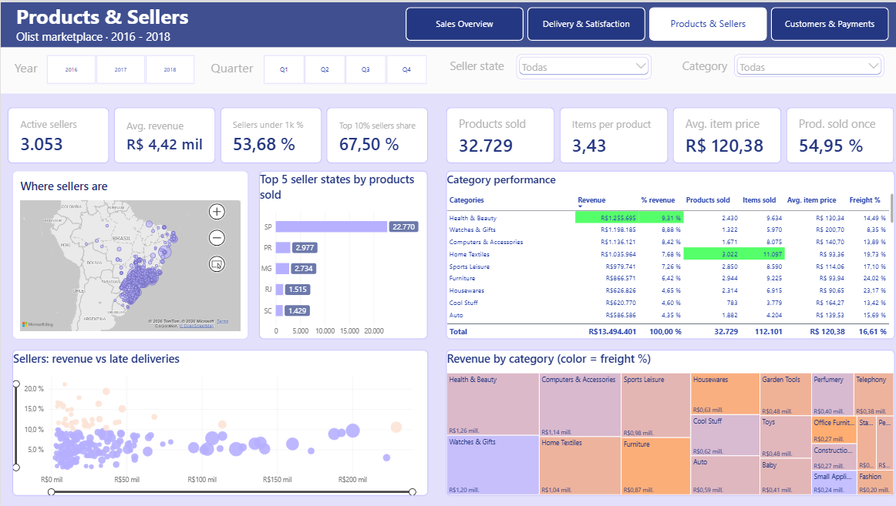
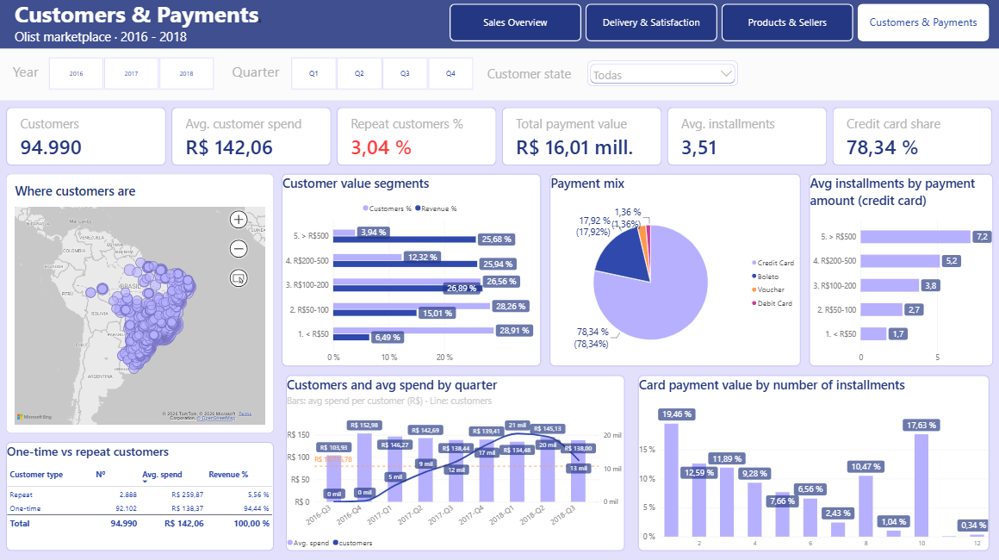

# Olist E-commerce: Power BI Relational Data Model & Dashboard

Personal portfolio project: a relational data model built in Power BI from nine raw CSV files, with data cleaning in Power Query, measures in DAX and a four-page report.

**At a glance:** 99,441 orders · 3,053 active sellers · 94,990 customers · R$ 13.49M of item revenue (Sep 2016 – Oct 2018).

## Dashboard

The report has four pages, each answering one business question.

### 1. Sales Overview: how is the business doing?



- Revenue reached **R$ 13.49M** from 98,199 orders, with an average order value of R$ 137.42.
- **Growth came from volume, not from bigger tickets.** 2018 (January to August only) already beats full-year 2017 (R$ 7.34M vs R$ 6.11M) while the average order value stays around R$ 137.
- Quarterly growth **slowed down in 2018**: R$ 2.41M in Q4 2017, R$ 2.76M in Q1 and R$ 2.85M in Q2 (2018-Q3 is incomplete).
- Revenue is concentrated: the **top 10 categories give 65%** of revenue (Health & Beauty 9.3%, Watches & Gifts 8.9%, Computers & Accessories 8.4%), and **SP, RJ and MG give 63%** (SP alone 38%).
- Shipping is 16.6% of revenue and almost every order is a single item (1.14 items per order).

### 2. Delivery & Satisfaction: do we keep our promise, and what does it cost?



- Only **6.8%** of deliveries arrive after the promised date, and the promise is conservative: 12.6 days actual vs 23.7 promised.
- **Lateness drives satisfaction**: the average score is 4.29 when on time and 2.27 when late. **62% of late deliveries get 1-2 stars, against 9% on time.**
- Severity matters: 1-3 days late = 3.29 stars, 4-7 days = 2.10, 8+ days = 1.70.
- Late orders spend most of their time with the carrier (28 days of shipping vs 8 on time); seller handling also doubles (6 vs 3 days).
- **Cross-state deliveries (64% of items) take 15.1 days vs 7.9 within the same state**, and are late 7.8% of the time vs 4.5%.
- Delays spike in November 2017 (12.4%) and February-March 2018 (14.1% and 19.0%). At state level, the higher the late rate, the lower the score (AL, MA and SE are the extremes).

### 3. Products & Sellers: what do we sell, and who sells it?



- **3,053 active sellers; the top 10% generate 67.5% of revenue** and 54% of sellers earn less than R$ 1,000.
- Sellers are concentrated in São Paulo: SP sellers sold 22,770 distinct products, against 2,977 for PR and 2,734 for MG.
- Long tail: 32,729 products sold, **55% of them only once** (3.4 items per product on average).
- Category economics differ: Watches & Gifts has the highest average price (R$ 200.70) and the lowest freight share (8.4%), while Furniture (24.0%) and Housewares (23.2%) pay the most shipping relative to their price.
- A group of large sellers combines high revenue with late-delivery rates above 10% (orange points in the scatter).

### 4. Customers & Payments: who buys, do they come back, and how do they pay?



- **Retention is very low**: only 3.04% of customers bought more than once (2,888 of 94,990). Repeat customers spend R$ 259.87 vs R$ 138.37, but they are 5.6% of revenue.
- Value is concentrated: the **3.9% of customers who spend more than R$ 500 generate 25.7% of revenue**.
- Credit card is 78.3% of the paid amount and boleto 17.9%; the average is 3.51 installments.
- **Installments finance bigger tickets**: the average rises from 1.7 (payments under R$ 50) to 7.2 (over R$ 500). 10-installment payments carry 17.6% of the card amount, almost as much as single payments (19.5%).
- The customer base grows every quarter while spend per customer stays flat (about R$ 134-153).

## Data source

Olist, & Sionek, A. (2018). *Brazilian E-Commerce Public Dataset by Olist* [Data set]. Kaggle. https://doi.org/10.34740/kaggle/dsv/195341

The data is **not included** in this repository. To reproduce the project, download the CSV files from Kaggle and place them in `data/raw/`. The Power BI file (`.pbix`) is not included either, because it embeds the dataset.

## Data model

| Table | Type | Grain (one row per...) | Key |
|---|---|---|---|
| `fact_order_items` | Fact | item of an order | `order_id` + `order_item_id` |
| `fact_order_payments` | Fact | payment of an order | `order_id` + `sequential` |
| `fact_order_reviews` | Fact | order (latest review) | `order_id` |
| `fact_orders` | Fact | order | `order_id` |
| `dim_customers` | Dimension | order (Olist creates a new customer id per order) | `customer_id` |
| `dim_products` | Dimension | product | `product_id` |
| `dim_sellers` | Dimension | seller | `seller_id` |
| `dim_calendar` | Dimension | day | `date` |

Several fact tables share dimensions (a fact constellation). Payments and reviews are order-level tables, so they are not joined to the order items: joining them would duplicate amounts.

## Key modelling decisions

- The original `customer_id` changes with every order; `customer_unique_id` identifies the person and is used to count customers.
- Only the latest review of each order is kept.
- Orders are grouped by status: *Completed*, *In Progress* and *Not Completed*. Revenue excludes *Not Completed* orders.
- A delivery is *late* when it arrives after the estimated date, comparing days and not hours.
- Product categories are translated to English and consolidated from 73 to about 45.
- Seller cities are cleaned with a mapping table; geolocation is reduced to one row per zip code and only used to add coordinates.

## Documentation

- [Data preparation and model documentation](docs/data-preparation.md): Power Query transformations by table, relationships and the reasoning behind each decision.
- [Measures and calculated columns](docs/measures.md): the DAX measures of the report and what they mean.

## Repository structure

```
├── README.md
├── docs/
│   ├── data-preparation.md
│   ├── measures.md
│   └── images/          report screenshots
└── data/
    └── raw/             CSV files (not included, see Data source)
```

## Status

Data model, cleaning and the four-page report are complete.
